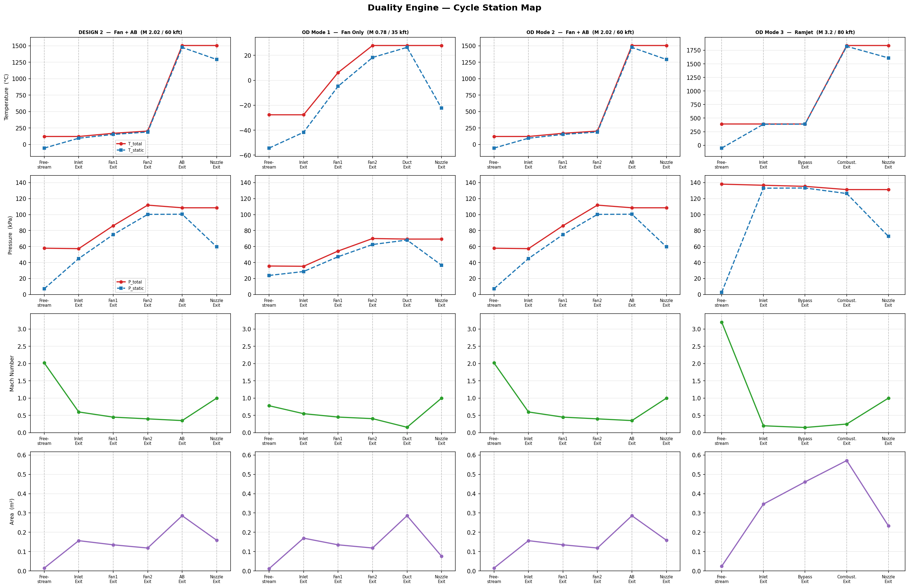

# Duality Sizing

Duality Sizing contains the Duality engine cycle model, aircraft weight/volume
closure, and constraint-analysis tools used for thrust-loading versus
wing-loading studies.

The upstream pyCycle source is not vendored in this repo. Install `om-pycycle`
as a dependency, then run the Duality scripts from this checkout.



## Setup

Install the package and dependencies in the active Python environment:

```powershell
pip install -e .
```

The current development environment has been run with:

```powershell
& 'C:\Users\AlexanderAmos\miniconda3\envs\cycle_env\python.exe' -m sizing.constraint_diagram
```

Because this repo previously installed `om-pycycle` in editable mode from the
same checkout, that environment may need a clean `om-pycycle` install after this
cleanup:

```powershell
pip uninstall om-pycycle
pip install om-pycycle
pip install -e .
```

## Main Outputs

Generate the Duality cycle station map:

```powershell
python propulsion/power_arc/duality.py
```

This writes:

```text
duality_cycle_map.png
duality_station_geometry.txt
```

Generate the integrated constraint diagram:

```powershell
python -m sizing.constraint_diagram
```

This writes:

```text
_constraint_diagram.png
```

## Constraint Cases

The default cases are defined in `sizing/constraint_diagram.py` by
`default_constraint_design_points()`.

The integrated diagram currently evaluates:

- constant-altitude/speed cruise
- constant-speed climb
- constant-altitude/speed turn
- climb acceleration
- ideal takeoff ground roll
- takeoff ground roll with drag and friction
- braking roll
- service ceiling
- takeoff climb angle

Shared thrust-loading math lives in `sizing/constraint_equations.py`.

## Repository Layout

- `propulsion/power_arc/duality.py`: Duality pyCycle model and cycle station map
- `sizing/`: aircraft geometry, volume, mission closure, and constraints
- `weight/`: aircraft weight models and mass-property helpers
- `mission/`: mission profiles and coupled AeroSandbox mission examples
- `tank/`: LNG tank models and property helpers
- `scripts/`: command-line helpers for mission and deck generation

## Notes

The `pycycle` package is provided by the external `om-pycycle` dependency. This
repo now keeps only the Duality-specific application code and generated outputs.
